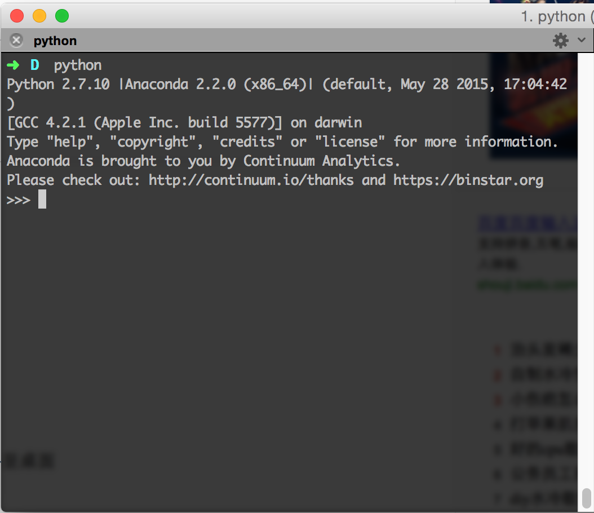
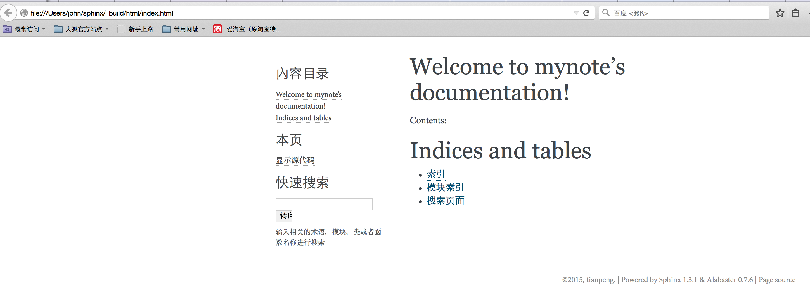

============================================================
使用CDN和SphinxDoc搭建文档或者博客
============================================================

------------------------
准备工作
------------------------

注意：按照此方法搭建的所谓博客实际上不能称为博客，但确实省钱方便管理，懒人或者穷人首选。

^^^^^^^^^^^^^^^^^^
购买CDN
^^^^^^^^^^^^^^^^^^

不想说太多，也没什么好说的，可选的一大堆，我这个用的又拍云的CDN。CDN通常是为加速网站资源访问服务的，
所以只能放置静态文件或者静态网站。域名可以在域名供应商那里购买到，CDN1G容量的100GB流量一年下来也
就几十块钱，如果用云主机可能只能够买一个月的，还要自己搭建各种环境。代码托管的云主机可能会便宜些，同
时能够运行动态文件，应该也不错，但是从来没用过，也懒得去维护。碰巧知道sphinxdoc可以生成书本一样的
文档，用来记录自己在编程学习和工作时的一些点滴，比起用有道云笔记、印象笔记还可以给大家分享。总的来说
还是不错的。

^^^^^^^^^^^^^^^^^^^^^^^^^^^^
在本地搭建Python环境
^^^^^^^^^^^^^^^^^^^^^^^^^^^^

Python编程环境的搭建，网上的教程有很多，不在赘述。懒人一枚，下了个集成的环境，叫Anaconda，之前也
用过Winpython之类的。其实对于干目前这件事是完全够用也差不多的，本人不是Python的专业程序员，不做
任何其他的评论。其实苹果的系统自己带Python的，只是软件包少，平时喜欢用Python的库写些短脚本，所以
装下更加专业的集成包还是不错的。官网的下载地址是：http://www.continuum.io/downloads。我用的
是Mac OS X的版本。Mac OS X是装在黑苹果机器上的，此前一直试图转到Ubuntu上，各种莫名其妙的问题已
经不想折腾了。下载完那个.sh文件之后，运行下列命令进行安装：

.. code-block:: sh

	bash Anaconda-2.3.0-MacOSX-x86_64.sh

安装过程中可能会让你输入密码来将Python的环境写入系统环境变量。完成后打开终端输入Python后会发现系
统的Python已经被替换为Anaconda的Python了，运行结果如下图：

.. _fig_0101: 

	
插图1 Anaconda安装后在终端中调用Python的截图

安装完Python环境，下面对Sphinx进行更新，命令是：

.. code-block:: sh
	
	pip install upgrade sphinx

^^^^^^^^^^^^^^^^^^^^^^^^^^^^
使用sphinx doc创建文档
^^^^^^^^^^^^^^^^^^^^^^^^^^^^

升级完成在你想创建项目的目录下面执行下列命令：

.. code-block:: sh

	➜  sphinx  sphinx-quickstart
	Welcome to the Sphinx 1.3.1 quickstart utility.

	Please enter values for the following settings (just press Enter to
	accept a default value, if one is given in brackets).
	#选择生成文档的根目录
	Enter the root path for documentation.
	> Root path for the documentation [.]:
	#是否将源文件目录和生成的文档的目录分离，默认分离
	You have two options for placing the build directory for Sphinx output.
	Either, you use a directory "_build" within the root path, or you separate
	"source" and "build" directories within the root path.
	> Separate source and build directories (y/n) [n]:
	#选择模板和静态文件的前缀，默认下划线
	Inside the root directory, two more directories will be created; "_templates"
	for custom HTML templates and "_static" for custom stylesheets and other static
	files. You can enter another prefix (such as ".") to replace the underscore.
	> Name prefix for templates and static dir [_]:
	#项目名称和作者名称
	The project name will occur in several places in the built documentation.
	> Project name: mynote
	> Author name(s): tianpeng
	#文档版本号
	Sphinx has the notion of a "version" and a "release" for the
	software. Each version can have multiple releases. For example, for
	Python the version is something like 2.5 or 3.0, while the release is
	something like 2.5.1 or 3.0a1.  If you don't need this dual structure,
	just set both to the same value.
	> Project version: 0.1
	> Project release [0.1]:
	#选择语言，默认en，如果希望使用中文请输入zh_CN
	If the documents are to be written in a language other than English,
	you can select a language here by its language code. Sphinx will then
	translate text that it generates into that language.

	For a list of supported codes, see
	http://sphinx-doc.org/config.html#confval-language.
	> Project language [en]: zh_CN
	#源文件后缀，默认rst
	The file name suffix for source files. Commonly, this is either ".txt"
	or ".rst".  Only files with this suffix are considered documents.
	> Source file suffix [.rst]:
	#主文件的去除后缀的名称，默认index
	One document is special in that it is considered the top node of the
	"contents tree", that is, it is the root of the hierarchical structure
	of the documents. Normally, this is "index", but if your "index"
	document is a custom template, you can also set this to another filename.
	> Name of your master document (without suffix) [index]:
	#是否配置以便生成epub
	Sphinx can also add configuration for epub output:
	> Do you want to use the epub builder (y/n) [n]:
	#一些配置，默认就行，更详细的解释去看官方文档
	Please indicate if you want to use one of the following Sphinx extensions:
	> autodoc: automatically insert docstrings from modules (y/n) [n]:
	> doctest: automatically test code snippets in doctest blocks (y/n) [n]:
	m intersphinx: link between Sphinx documentation of different projects (y/n) [n]:
	> todo: write "todo" entries that can be shown or hidden on build (y/n) [n]:
	> coverage: checks for documentation coverage (y/n) [n]:
	> pngmath: include math, rendered as PNG images (y/n) [n]:
	> mathjax: include math, rendered in the browser by MathJax (y/n) [n]:
	> ifconfig: conditional inclusion of content based on config values (y/n) [n]:
	> viewcode: include links to the source code of documented Python objects (y/n) [n]:
	#是否生成Makefile和Windows命令文件，用于运行make html命令
	A Makefile and a Windows command file can be generated for you so that you
	only have to run e.g. `make html' instead of invoking sphinx-build
	directly.
	> Create Makefile? (y/n) [y]:
	> Create Windows command file? (y/n) [y]:

	Creating file ./conf.py.
	Creating file ./index.rst.
	Creating file ./Makefile.
	Creating file ./make.bat.
	#创建结束
	Finished: An initial directory structure has been created.

	You should now populate your master file ./index.rst and create other documentation
	source files. Use the Makefile to build the docs, like so:
	   make builder
	where "builder" is one of the supported builders, e.g. html, latex or linkcheck.

生成的项目目录的文件结构：
::

	├── Makefile  #linux或者MaxOS用的Make文件
	├── _build    #生成的HTML文件和其它文件
	├── _static		#图片、CSS、js文件放置于此处
	├── _templates	#模板放置此处
	├── conf.py     #配置文件
	├── index.rst	#主文件
	└── make.bat    #Windows用的命令文件

在项目目录下执行 make html 命令后：
::

	├── Makefile
	├── _build
	│   ├── doctrees
	│   │   ├── environment.pickle
	│   │   └── index.doctree
	│   └── html                      #所生成文档根目录，也就是网站的根目录
	│       ├── _sources
	│       │   └── index.txt
	│       ├── _static
	│       │   ├── ajax-loader.gif
	│       │   ├── alabaster.css
	│       │   ├── basic.css
	│       │   ├── comment-bright.png
	│       │   ├── comment-close.png
	│       │   ├── comment.png
	│       │   ├── doctools.js
	│       │   ├── down-pressed.png
	│       │   ├── down.png
	│       │   ├── file.png
	│       │   ├── jquery-1.11.1.js
	│       │   ├── jquery.js
	│       │   ├── minus.png
	│       │   ├── plus.png
	│       │   ├── pygments.css
	│       │   ├── searchtools.js
	│       │   ├── translations.js
	│       │   ├── underscore-1.3.1.js
	│       │   ├── underscore.js
	│       │   ├── up-pressed.png
	│       │   ├── up.png
	│       │   └── websupport.js
	│       ├── genindex.html
	│       ├── index.html
	│       ├── objects.inv
	│       ├── search.html
	│       └── searchindex.js
	├── _static
	├── _templates
	├── conf.py
	├── index.rst
	└── make.bat

使用浏览器打开html文件夹里的index.html可以发现，文档已经生成，如图：

.. _fig_0102: 

插图2 使用浏览器打开html文件夹里的index.html后的截图

觉得默认的主题不合口味，编辑conf.py来修改主题，我用的是sphinx_rtd_theme。地址是：
https://pypi.python.org/pypi/sphinx_rtd_theme/。页面下面有使用说明，不在赘述，较新版本已
经自带，修改配置文件即可，这也是上面直接安装后就更新的原因。

下面放几个参考的链接，通过这些网站可以学习reStructuredText的语法，用来编写文档。

http://zh-sphinx-doc.readthedocs.org/en/latest/index.html

http://jwch.sdut.edu.cn/book/rst.html

`官方网站 <http://sphinx-doc.org/>`_

